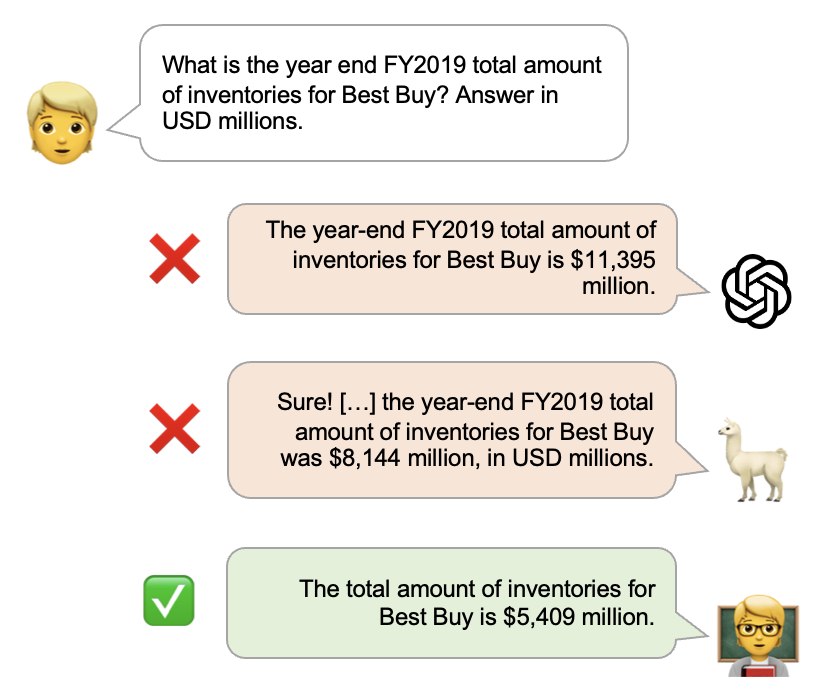

# FinanceBench: A New Benchmark for Financial Question Answering

<p align="center">
    
</p>

**Abstract:** 
FinanceBench is a first-of-its-kind test suite for evaluating the performance of LLMs on open book financial question answering (QA). This repository contains an open source sample of 150 annotated examples used in the evaluation and analysis of models assessed in the FinanceBench paper. FinanceBench comprises 10,231 questions about publicly traded companies, with corresponding answers and evidence strings. The questions in FinanceBench are ecologically valid and cover a diverse set of scenarios. They are intended to be clear-cut and straightforward to answer to serve as a minimum performance standard. We test 16 state of the art model configurations (including GPT-4-Turbo, Llama2 and Claude2, with vector stores and long context prompts) on a sample of 150 cases from FinanceBench, and manually review their answers (n=2,400). The cases are available open-source. We show that existing LLMs have clear limitations for financial QA. Notably, GPT-4-Turbo used with a retrieval system incorrectly answered or refused to answer 81\% of questions. While augmentation techniques such as using longer context window to feed in relevant evidence improve performance, they are unrealistic for enterprise settings due to increased latency and cannot support larger financial documents. We find that all models examined exhibit weaknesses, such as hallucinations, that limit their suitability for use by enterprises.

[](https://arxiv.org/abs/2311.11944)

**Contact:**
To evaluate your models on the full `FinanceBench` dataset, or if you have questions about this work, you can email us at contact@patronus.ai

---

**Dataset Overview:**
The provided open-source dataset (n=150) consists of the following attributes:

```
    - financebench_id:  unique question identifier  
    - question:         question of interest
    - answer:           gold answer
    - question_type:    type of the question {domain-relevant, metrics-generated, novel-generated}
    - doc_name:         name of the relevant financial document to answer the question
    - doc_link:         url to retrieve the relevant financial document
    - doc_period:       period of the relevant financial document
    - evidence_text:    extracted evidence text
    - page_number       page number(s) of evidence text
```

---

**Citation:** If you use our open-source dataset or refer to our result, please use the following citation:
```latex
@misc{islam2023financebench,
      title={FinanceBench: A New Benchmark for Financial Question Answering}, 
      author={Pranab Islam and Anand Kannappan and Douwe Kiela and Rebecca Qian and Nino Scherrer and Bertie Vidgen},
      year={2023},
      eprint={2311.11944},
      archivePrefix={arXiv},
      primaryClass={cs.CL}
}
```
